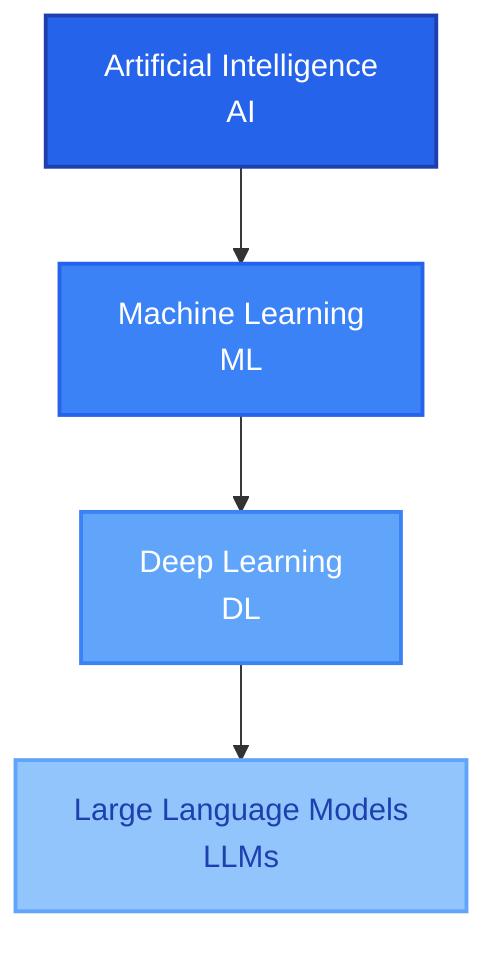
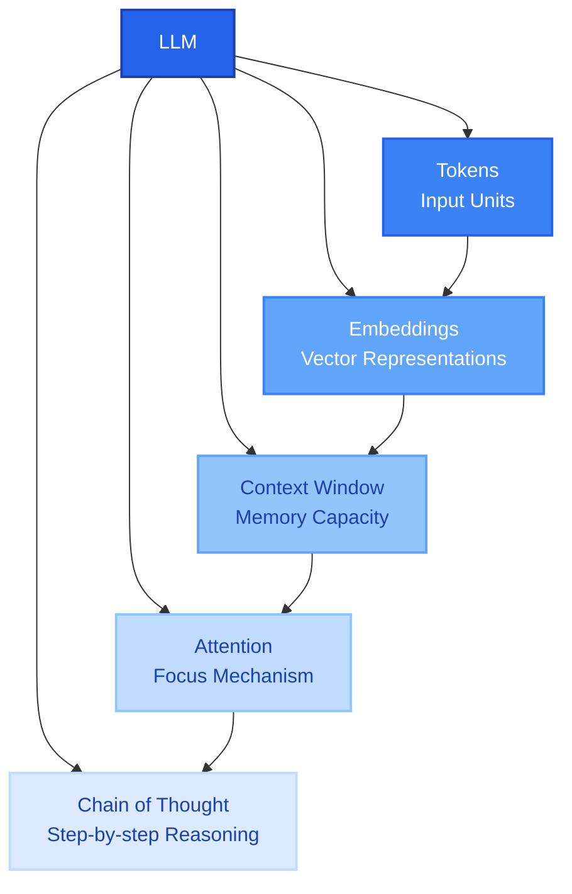
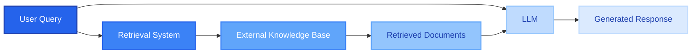

# AI Basics

## What is AI?

Artificial Intelligence (AI) is the broad field of creating machines and systems that can perform tasks typically requiring human intelligence. This includes reasoning, learning, perception, and decision-making.

## Machine Learning

Machine Learning is a subset of AI that enables systems to learn and improve from experience without being explicitly programmed. Instead of following pre-written rules, ML algorithms identify patterns in data to make predictions or decisions.

## Deep Learning

Deep Learning is a subset of Machine Learning that uses artificial neural networks with multiple layers (hence "deep") to learn complex patterns in data. These networks can automatically discover intricate structures in high-dimensional data.

## Large Language Models (LLMs)

LLMs are a type of Deep Learning model trained on vast amounts of text data. They can understand, generate, and work with human language in sophisticated ways, enabling applications like chatbots, translation, and content generation.

## Hierarchy Diagram

## LLM Concepts

### Tokens

A token is a minimal text unit that the model processes. It is not exactly one word. A token could be:

* An entire word
* Part of a word
* Just one number
* Just one symbol
* A space

The quantity of tokens can change depending on the language. We could estimate that a token equals approximately 4 characters, but this is not a general rule and can also change depending on the model.

### Embeddings

An embedding is a numeric representation of a text's meaning. An embedding is expressed as a vector in a space of hundreds or thousands of dimensions where texts with similar meanings are located close to each other.

You can visit [this link](https://projector.tensorflow.org) to see a graphic representation of an embedding in three dimensions.

### Context Window

The context window is like the "memory" of the LLM. It is the capacity that the LLM has to read tokens. The longer the context window, the greater the capacity of the model to keep more information present.

### Attention Models

Attention is how the model decides which parts of the text are more important within the [[AI-Basics#Context Window|Context Window]]. Some important aspects for attention are:

* Semantic Relation
* Format & Structure of the Text
* Emphasis and Repetition of some words
* Role and Initial Context

### Chain of Thought 

Chain of Thought is the step-by-step reasoning that an LLM does before giving an answer. This helps to achieve better results in complex tasks like logical reasoning and math, but it also takes more time and consumes more [[AI-Basics#Tokens|tokens]].

Months ago you had to explicitly ask the model to show its reasoning process in the prompt. However, now most advanced models do this reasoning internally by default, deciding how much step-by-step thinking is needed for each problem. 

### LLM Concepts Graph

### Retrieval-Augmented Generation (RAG)

RAG is a system architecture for applications based on LLMs that integrates retrieval of external information at inference time. The system retrieves relevant documents or data from an external knowledge base, then provides this information to the LLM along with the user's query. This enables the model to combine the information from the prompt with the information that was retrieved from external sources, allowing it to answer questions about information that wasn't in its training data. RAG is often used together with [[AI-Prompt-Engineering#Grounding|Grounding]] techniques to ensure the model bases its answers on the retrieved information.

