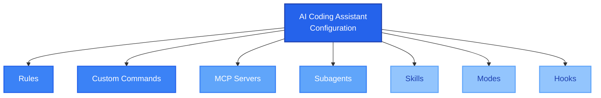

# AI Coding Assistants Configuration

When you work with AI coding assistants like [Cursor](AI-tools.md#cursor), [Claude Code](AI-tools.md#claude-code), or [Windsurf](AI-tools.md#windsurf), you quickly realize that the chat is just the surface. Behind it, there are several configuration mechanisms that let you shape how the AI behaves, what it can access, and how it works within your project. The problem is that each tool calls these things differently, and not all of them support the same features. This document covers the main ones.

---

## Rules

Rules are persistent instructions that the AI follows every time it works on your project. Think of them as a way to tell the AI "this is how we do things here" without having to repeat yourself in every conversation. They can include coding standards, architectural decisions, preferred libraries, naming conventions, or anything that you want the AI to always keep in mind.

The key difference between rules and a regular prompt is that rules persist across sessions. You write them once and they apply automatically, so you don't need to explain the same context every time you start a new chat.

### How each tool calls them

| Tool | Name | Where to define them |
|------|------|---------------------|
| **Cursor** | Rules | `.cursor/rules/` folder (`.mdc` files) with metadata like description and glob patterns to specify when the rule applies. Also supports global user rules in settings. |
| **Claude Code** | CLAUDE.md | `CLAUDE.md` files at the root of your project, or in subdirectories. Claude Code reads them automatically. You can also have a global `~/.claude/CLAUDE.md` for rules across all projects. |
| **Windsurf** | Rules / AGENTS.md | Global: `global_rules.md` (applied across all workspaces). Workspace: `.windsurf/rules/` folder (markdown files with frontmatter for activation patterns like globs or model decision). Directory-scoped: `AGENTS.md` files that apply automatically based on file location. Older versions used `.windsurfrules` at the root (legacy). |
| **GitHub Copilot** | Instructions | `.github/copilot-instructions.md` for project-level instructions. |

**When to use them:**

* When your team has coding standards that the AI should always follow (naming conventions, error handling patterns, preferred frameworks).
* When the project has architectural decisions that affect how code should be written, for example "we always use repository pattern" or "never use ORM, use raw SQL."
* When you find yourself repeating the same instruction in every conversation.
* When you want consistency, especially if multiple people on the team use the AI assistant on the same project.

---

## Custom Commands

Custom commands are shortcuts that trigger a specific behavior or workflow. Instead of writing a long prompt every time you want the AI to do something specific, you define a command once and then invoke it with a short name. For example, you could have a `/review` command that tells the AI exactly how you want code reviews done, or a `/test` command that generates tests following your project's conventions.

### How each tool calls them

| Tool | Name | How they work |
|------|------|---------------|
| **Cursor** | Custom Commands | Markdown files stored in `.cursor/commands/` (project-level) or `~/.cursor/commands/` (global). You invoke them by typing `/` in the chat, and Cursor shows all available commands to pick from. |
| **Claude Code** | Slash Commands | Built-in commands like `/init`, `/compact`, `/cost`. You can also create custom ones by placing markdown files in `.claude/commands/` folder. |
| **Windsurf** | Workflows | Markdown files stored in `.windsurf/workflows/`. You invoke them by typing `/workflow-name` in Cascade. They support sequential steps and nested workflows (one workflow calling another). |

**When to use them:**

* When you have a repetitive workflow that you do many times per day, like generating a specific type of component, running a review checklist, or formatting a commit message.
* When you want to standardize how specific tasks are done across the team, so everyone gets the same results.
* When a task requires a very specific and long prompt that you don't want to type or remember every time.

---

## MCP Servers

MCP stands for Model Context Protocol. It is an open standard that allows AI coding assistants to connect with external tools and services. Instead of the AI being limited to reading files and running terminal commands, MCP lets it interact with things like databases, browsers, APIs, design tools, or any custom service.

An MCP server is basically a small program that exposes a set of capabilities (called "tools") through the MCP protocol. The AI assistant connects to these servers and can use those tools during a conversation. For example, a browser MCP server lets the AI navigate web pages, click buttons, and take screenshots. A database MCP server could let the AI run queries directly.

### How each tool calls them

| Tool | Name | Configuration |
|------|------|---------------|
| **Cursor** | MCP Servers | Configured in `.cursor/mcp.json` at the project level, or globally in settings. |
| **Claude Code** | MCP Servers | Configured in `.mcp.json` at the project level, or globally in `~/.claude.json`. |
| **Windsurf** | MCP Servers | Configured in `~/.codeium/windsurf/mcp_config.json` globally. |

All three tools support the same MCP protocol, which means that in theory, the same MCP server can work with any of them.

**When to use them:**

* When you need the AI to interact with something outside the codebase, like a database, an API, or a browser.
* When you want to test your web application directly from the AI conversation, for example navigating your app and checking if a UI change looks correct.
* When your workflow requires information that the AI can't get just by reading files, like data from Jira, Figma, or a monitoring tool.
* When you want to extend the AI's capabilities without waiting for the tool vendor to build that feature.

---

## Subagents

Subagents are secondary AI agents that the main agent can launch to handle specific tasks in parallel or independently. When the AI is working on a complex task, instead of doing everything sequentially, it can delegate parts of the work to subagents that run simultaneously. Each subagent gets its own context and can use its own set of tools.

For example, if you ask the AI to refactor a large codebase, the main agent could launch one subagent to explore the folder structure, another to search for all usages of a function, and a third one to check the tests. All of them would work at the same time and report back.

### How each tool calls them

| Tool  | Name  | Details |
|------|------|---------------|
| **Cursor**   | Subagents / Task tool  | Launches subagents specialized for general tasks, codebase exploration, shell commands, or browser interaction. You can assign different models to each subagent (e.g., using a faster, cheaper model for lightweight tasks).|
| **Claude**  | Subagents  | Supports built-in subagents (e.g., Explore, Plan) and custom subagents defined as markdown files in `.claude/agents/` or `~/.claude/agents/`. Each can have its own prompt, tool access, or model. Invoke them with `/agents` or have them triggered automatically.             |
| **Windsurf** | Not explicitly supported | Cascade does multi-step tasks, but explicit subagent management or configuration isn't available for users.                                                                                  

**When to use them:**

* The AI typically decides when to use subagents based on the complexity of the task. However, understanding that they exist helps you write better prompts. For example, if you tell the AI "explore the authentication module and the database module and then propose a refactor," it knows it can explore both modules in parallel.
* In Claude Code, you can create custom subagents when you want to route specific types of tasks to cheaper models (saving costs), or when you want to restrict what tools a subagent can use for security or safety reasons.
* If you're building custom tools or integrations, understanding subagents helps you design workflows that can run parts of the work concurrently.

---

## Skills

Skills are reusable instruction sets that teach the AI how to perform a specific type of task. While rules tell the AI general things about your project, skills are more like step-by-step guides for a particular workflow or capability. They are designed to be portable, meaning you could use the same skill across different projects.

For example, you could have a skill that teaches the AI how to create a new Cursor rule, how to set up a specific type of project, or how to deploy to a specific environment. The AI reads the skill file when it detects that the current task matches what the skill is about.

### How each tool calls them

| Tool | Name | Details |
|------|------|---------|
| **Cursor** | Skills | Defined as `SKILL.md` files with a description of when they should be used. The AI reads them automatically when the task matches. |
| **Claude Code** | Skills | Defined as `SKILL.md` files in `.claude/skills/` (project-level) or `~/.claude/skills/` (personal). Each skill has YAML frontmatter with a name (which becomes a `/slash-command`) and a description. Claude can invoke them automatically based on context, or you can trigger them manually. |
| **Windsurf** | Skills | Defined as `SKILL.md` files in `.windsurf/skills/` (project-level) or `~/.codeium/windsurf/skills/` (global). Similar format with YAML frontmatter. Skills can be invoked automatically or manually with `@skill-name`. |

**When to use them:**

* When you have a complex workflow that you want the AI to execute the same way every time, like setting up a new microservice with specific boilerplate, or creating a migration following specific steps.
* When you want to share knowledge across projects. For example, a skill for "how to create a Cursor rule" works regardless of what project you are in.
* When a task requires very specific instructions that are too detailed for a rule but too reusable for a one-time prompt.

---

## Modes

Modes change how the AI interacts with you and your codebase. Each mode is optimized for a different type of work. Some modes give the AI full access to read and write files, run commands, and make changes. Other modes restrict the AI to just reading and answering questions, which is useful when you don't want it to accidentally modify something.

The idea is that not every interaction requires the same level of autonomy. Sometimes you want the AI to just answer a question without touching anything. Other times you want it to take full control and implement a feature end-to-end.

### How each tool calls them

| Tool | Modes available |
|------|----------------|
| **Cursor** | **Agent** (full autonomy, can read/write/run commands), **Ask** (read-only, just answers questions), **Plan** (read-only, designs approach before coding), **Debug** (systematic troubleshooting with runtime evidence). Inline Edit (Cmd+K) is a separate tool for quick code changes, not a mode. |
| **Claude Code** | **Default** (standard behavior, asks for permission on first use of each tool), **Plan** (read-only, can analyze but not modify files or run commands, triggered with `--permission-mode plan` on CLI or `/plan` in interactive mode). Also has permission modes like **acceptEdits** (auto-accepts file edits) and **bypassPermissions** (skips all prompts, only for sandboxed environments). |
| **Windsurf** | **Code** (full autonomy, can create and modify files), **Chat** (conversational mode, more like a Q&A without file modifications), **Plan** (creates a persistent planning document that Cascade follows throughout the task, useful for complex multi-step work). All of these run inside what Windsurf calls "Cascade," which is the name of the agentic system itself. |

**When to use them:**

* Use the full autonomy mode (Agent/Default/Code) when you want the AI to implement something end-to-end: write code, create files, run tests, fix errors.
* Use the read-only mode (Ask/Chat) when you want to understand code, ask questions about the architecture, or explore the codebase without risk of anything being modified.
* Use Plan mode when the task is large or ambiguous and you want to discuss the approach before any code is written. This is especially useful for refactors or architectural changes where a wrong decision early on can be expensive.
* Use Debug mode (in Cursor) when you have a bug and need the AI to investigate systematically with evidence from logs, error messages, and runtime behavior.

---

## Hooks

Hooks are scripts that run automatically before or after certain AI events. They let you automate actions that should always happen at specific points in the workflow, without relying on the AI remembering to do them. Think of them like Git hooks, but for AI interactions.

For example, you could set up a hook that automatically runs a linter every time the AI saves a file, or a hook that formats code before a commit, or one that runs tests after the AI finishes an edit.

### How each tool calls them

| Tool | Name | Details |
|------|------|---------|
| **Cursor** | Agent Hooks | Configured in `.cursor/hooks.json` (project-level) or `~/.cursor/hooks.json` (global). Hooks communicate via JSON over stdio and cover many lifecycle events: `beforeShellExecution`, `afterFileEdit`, `sessionStart`, `beforeSubmitPrompt`, and more. Cursor can also read Claude Code hook configurations from `.claude/settings.json` and map them automatically. |
| **Claude Code** | Hooks | Configured in `.claude/settings.json` or `~/.claude/settings.json`. You define the event (like `PreToolUse`, `PostToolUse`, `Notification`) and the command to run. They execute automatically, not controlled by the AI. |
| **Windsurf** | Cascade Hooks | Configured in `.windsurf/hooks.json` (workspace-level) or at user/system level. Supports hooks for events like code writing, cascade responses, and prompt submission. Hooks can block actions via exit codes, which is useful for enforcing security policies. |

**When to use them:**

* When you want to enforce something that the AI should never skip, like running a linter or formatter after every file edit.
* When you need to integrate external validation into the AI workflow, for example running a custom script that checks if the AI's changes follow security policies.
* When you want to log or audit AI actions automatically, without depending on the AI to do it.
* When you have a pre-commit or CI step that you want to run locally during the AI session to catch issues early.

---

## Summary Table

| Feature | Cursor | Claude Code | Windsurf |
|---------|--------|-------------|----------|
| **Rules** | `.cursor/rules/*.mdc` | `CLAUDE.md` | `global_rules.md`, `.windsurf/rules/`, `AGENTS.md` |
| **Custom Commands** | `.cursor/commands/` | `.claude/commands/` | `.windsurf/workflows/` (Workflows) |
| **MCP Servers** | `.cursor/mcp.json` | `.mcp.json` | `mcp_config.json` |
| **Subagents** | Supported (Task tool) | Supported + custom (`.claude/agents/`) | Not explicit |
| **Skills** | `SKILL.md` files | `.claude/skills/` | `.windsurf/skills/` |
| **Modes** | Agent, Ask, Plan, Debug | Default, Plan | Code, Chat, Plan |
| **Hooks** | `.cursor/hooks.json` | `.claude/settings.json` | `.windsurf/hooks.json` |
