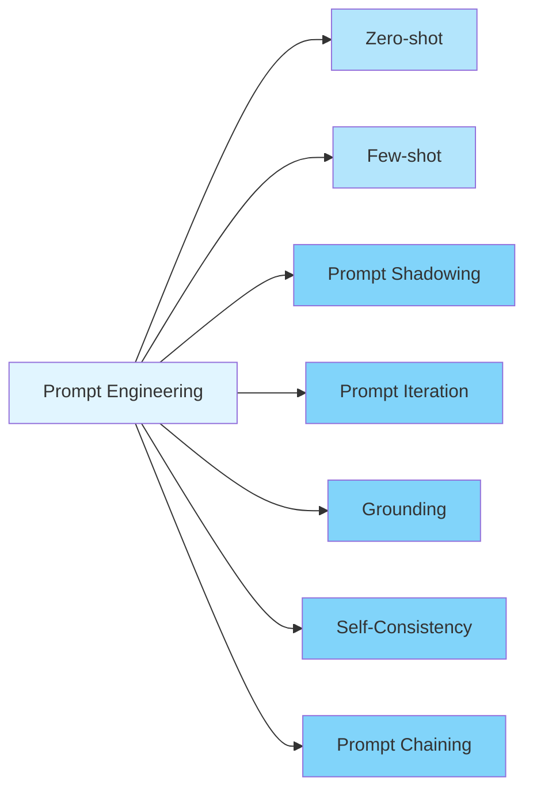
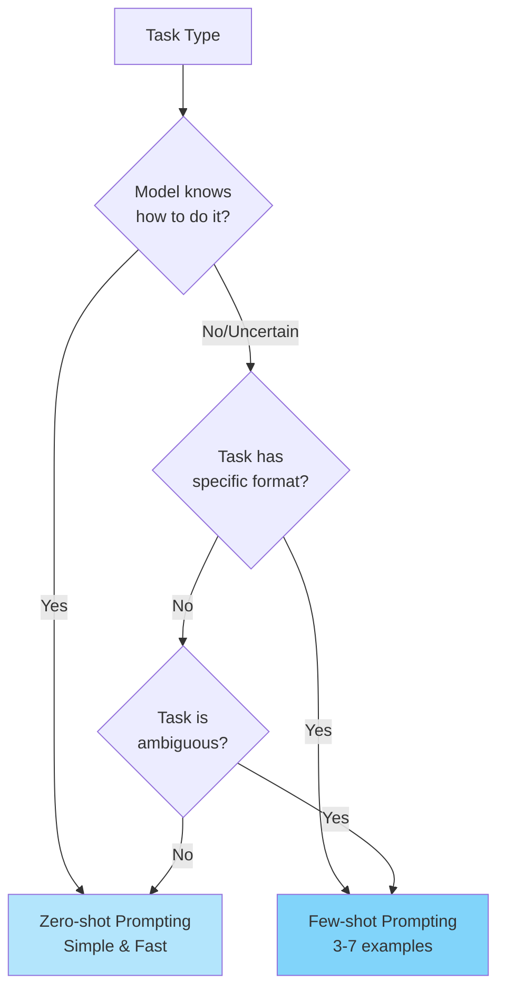

# Prompt Engineering

Prompt engineering is the practice of designing and refining inputs (prompts) to guide a large language model toward producing accurate, relevant, and reliable outputs.

## Prompt Engineering Techniques

There are many different prompt engineering techniques that you can use to achieve different results. Some of them are:

### Zero-shot Prompting

This is when you don't use examples for the model, just instructions. This is the simplest, cheapest, and fastest option.

**When to use it?** When the model "already knows" how to do it, for example:

* Translation
* Summary
* Rewriting

You can also use this technique when the information does not require a specific format or when you need the result for exploration like brainstorming or drafts.

### Few-shot Prompting

This is when you give the model one or more examples of the real task in your prompt. Normally it is good to have between 3-7 examples, and it is important to have both positive and negative examples, which means having examples explaining how to do it and how not to do it to avoid biases.

**When to use it?** You can use it when the task is ambiguous, subjective, complex, has a specific format, or you want to replicate something. Examples:

* Defined Structure (JSON, YAML, DSL, Logs)
* Specific Domains (Internal business rules, compliance)
* Zero-shot is not reliable
* Ambiguous Classification (Prioritization of Tickets)

### Prompt Shadowing

### Prompt Iteration/Refinement

### Grounding

### Self-Consistency

### Prompt Chaining