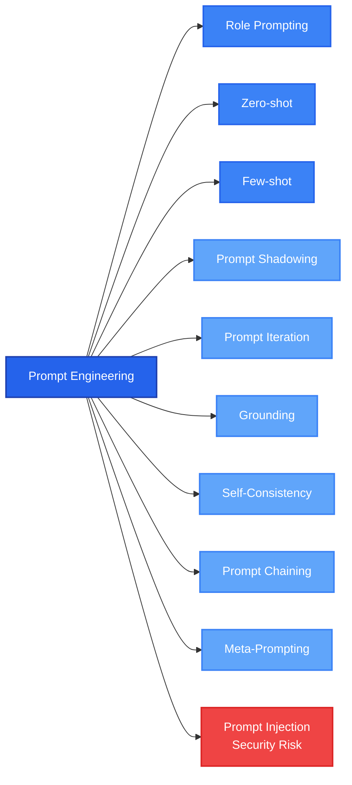
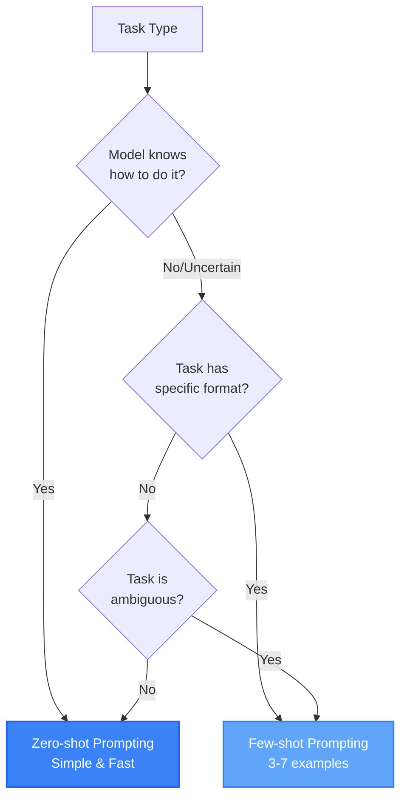
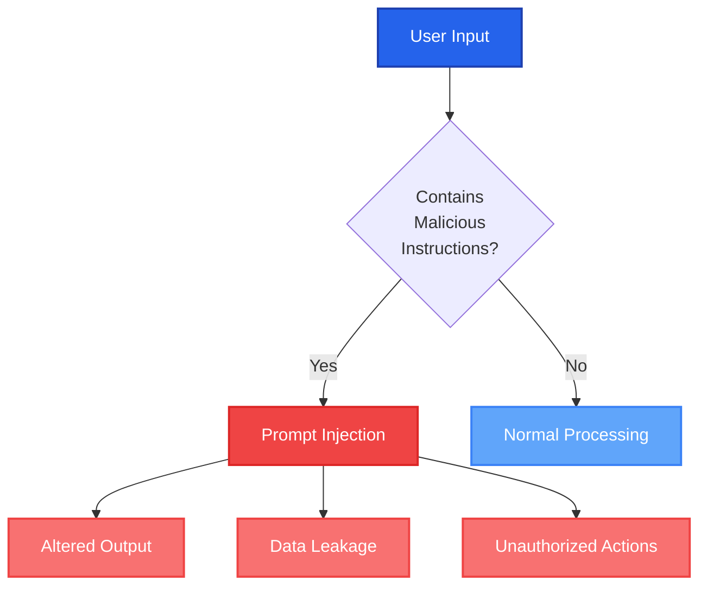

# Prompt Engineering

Prompt engineering is the practice of designing and refining inputs (prompts) to guide a large language model toward producing accurate, relevant, and reliable outputs.

## Prompt Engineering Techniques

There are many different prompt engineering techniques that you can use to achieve different results. Some of them are:

### Role Prompting

Role prompting is a prompt engineering technique that explicitly instructs an LLM to adopt a specific role, persona, or function in order to condition its style, priorities, and reasoning. Conceptually, this guides the model's internal [[AI-Basics#Embeddings|Embeddings]] toward a different region of its latent space, without changing the model itself.

**When to use it?** When you need to align the level, focus, and style of the answer with a specific context. Examples:

* You need a defined level of experience: `You are a computer science professor...`
* The style of communication matters: `You are a technical writer.`

### Zero-shot Prompting

This is when you don't use examples for the model, just instructions. This is the simplest, cheapest, and fastest option.

**When to use it?** When the model "already knows" how to do it, for example:

* Translation
* Summary
* Rewriting

You can also use this technique when the information does not require a specific format or when you need the result for exploration like brainstorming or drafts.

### Few-shot Prompting

This is when you give the model one or more examples of the real task in your prompt. Normally it is good to have between 3-7 examples, and it is important to have both positive and negative examples, which means having examples explaining how to do it and how not to do it to avoid biases.

**When to use it?** You can use it when the task is ambiguous, subjective, complex, has a specific format, or you want to replicate something. Examples:

* Defined Structure (JSON, YAML, DSL, Logs)
* Specific Domains (Internal business rules, compliance)
* Zero-shot is not reliable
* Ambiguous Classification (Prioritization of Tickets)

### Prompt Iteration/Refinement

It is the most common process that people use when interacting with LLMs. This is the process of improving a prompt in iterations, based on the evaluation and feedback of the output.

**When to use it?** When the output is correct but the quality, alignment, or format is not according to your needs. For example:

1. First input: Summarize this document.
2. Second input: Summarize the document in 5 bullet points. Each bullet must describe a technical decision and its impact.

### Grounding

This is an important technique where we tell the model to base its answers on specific information that we know is real. By doing this, the model does not answer just based on its training patterns, but it will be conditioned to the information that we provide.

Normally in grounding we tell the model to answer based only on the information provided, and if the information is not there, to answer something like "information not found."

**When to use it?** When accuracy is more important than fluency.

**Example:** You must answer using only the information provided in the document <DOCUMENT_NAME>. If the answer cannot be found in the text, reply with: "Not available in the provided context."

### Self-Consistency

It is a technique where we generate multiple results (typically 5-10 outputs) for the same problem. This enables the LLM to "think" in different ways, and we can choose the most common answer (majority vote) or check why one or some answers were different.

**When to use it:** When the problem requires reasoning, it has one correct answer or at least a small set of answers, like:

* Math and logic problems
* Algorithm problems
* Code analysis

### Prompt Chaining

This technique consists of breaking down a complex and large task into multiple prompts where the output of one prompt is the input of another one.

**When to use it:** Use this when the task is not atomic and can be split into small tasks with clear responsibilities. For example:

* When you need a mix between reasoning and format:
    1. Understand the problem
    2. Reasoning
    3. Produce code/JSON file (any format)

```mermaid
graph LR
    A[Complex Task] --> B[Prompt 1<br/>Understand Problem]
    B --> C[Output 1]
    C --> D[Prompt 2<br/>Reasoning]
    D --> E[Output 2]
    E --> F[Prompt 3<br/>Format Output]
    F --> G[Final Result]
    
    style A fill:#2563eb,stroke:#1e40af,stroke-width:2px,color:#fff
    style B fill:#3b82f6,stroke:#2563eb,stroke-width:2px,color:#fff
    style C fill:#60a5fa,stroke:#3b82f6,stroke-width:2px,color:#fff
    style D fill:#3b82f6,stroke:#2563eb,stroke-width:2px,color:#fff
    style E fill:#60a5fa,stroke:#3b82f6,stroke-width:2px,color:#fff
    style F fill:#3b82f6,stroke:#2563eb,stroke-width:2px,color:#fff
    style G fill:#93c5fd,stroke:#60a5fa,stroke-width:2px,color:#1e40af
```

### Meta-Prompting

It is the use of an LLM to create, analyze, or improve our prompts. In short, it is using a prompt to create a prompt. It is important to mention that this is good as a tool to design and have ideas about our prompts. However, as with everything with LLMs, we should have the final word.

**When to use it:**

* Discover good prompt structures
* Creating educational content or teaching materials
* Fast prototyping

**Bonus:** When you use [[AI-Prompt-Engineering#Prompt Iteration/Refinement|Prompt Iteration]], you can say to the model something like "give me the prompt that I should use from the beginning to have this result" and you can check what you can improve in your prompt.

### Prompt Shadowing

It is the technique that you use intentionally to override an earlier instruction by providing a new instruction later. Due to how the [[AI-Basics#Context Window|Context Window]] works, more recent instructions can override earlier ones. For example, you start by telling the model to answer something in JSON, but at the end in another prompt you say to answer in YAML, effectively replacing the JSON instruction.

### Prompt Injection

Actually, prompt injection is not a technique—it is a security vulnerability in LLM systems where a non-trusted prompt manages to alter the output. For example, if you have an automation that answers emails automatically or reads documents, those emails or documents might contain hidden instructions that trick the system into sending information to a specific user, leaking credentials, or exposing personal information. This vulnerability could be worse if your LLM uses a [[AI-Basics#Retrieval-Augmented Generation (RAG)|RAG]] architecture, because malicious content could be injected into the knowledge base and then retrieved.

